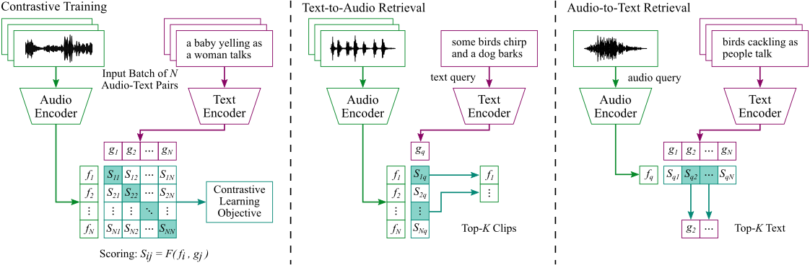

# Negative Sampling for Contrastive Audio-Text Retrieval (ICASSP 2023)

This repository provides source code for [our paper](https://arxiv.org/abs/2211.04070):

```
@InProceedings{Xie2023On,
    author = {Xie, Huang and Räsänen, Okko and Virtanen, Tuomas},
    title = {{On Negative Sampling for Contrastive Audio-Text Retrieval}},
    booktitle = {ICASSP 2023 - 2023 IEEE International Conference on Acoustics, Speech and Signal Processing (ICASSP)},
    year = {2023},
    pages = {1-5},
    doi = {10.1109/ICASSP49357.2023.10095319}
}
```

# Contrastive Audio-Text Retrieval Framework



# Code Tutorial

This codebase is developed with Python 3.9 and [PyTorch 1.13.0](https://pytorch.org/).

1. Check out source code and install required python packages:

```
git clone https://github.com/xieh97/contrastive-negative-sampling.git
pip install -r requirements.txt
```

2. Download the [Clotho](https://zenodo.org/record/4783391) dataset:

```
Clotho
├─ clotho_captions_development.csv
├─ clotho_captions_validation.csv
├─ clotho_captions_evaluation.csv
├─ development
│   └─...(3839 wavs)
├─ validation
│   └─...(1045 wavs)
└─ evaluation
    └─...(1045 wavs)
```

3. Pre-process audio and caption data:

```
preprocessing
├─ text_cleaning.py             # clean audio captions
├─ clotho_dataset.py            # tokenize audio captions, generate fids and cids
├─ word2vec_embeddings.py       # generate word embeddings using pretrained Word2Vec
└─ audio_logmel.py              # extract log-mel energies from audio clips
```

4. Train the audio-text retrieval system ([More details](https://arxiv.org/abs/2110.02939)):

```
models
├─ core.py                      # dual-encoder framework
├─ audio_encoders.py            # audio encoders
└─ text_encoders.py             # text encoders

utils
├─ criterion_utils.py           # loss functions
├─ data_utils.py                # Pytorch dataset classes
└─ model_utils.py               # model.train(), model.eval(), etc.

conf.yaml                       # experimental settings
main.py                         # main()
```

5. Calculate retrieval metrics:

```
postprocessing
├─ xmodal_scores.py             # calculate audio-text scores
└─ xmodal_retrieval.py          # calculate mAP, R@1, R@5, R@10, etc.
```
